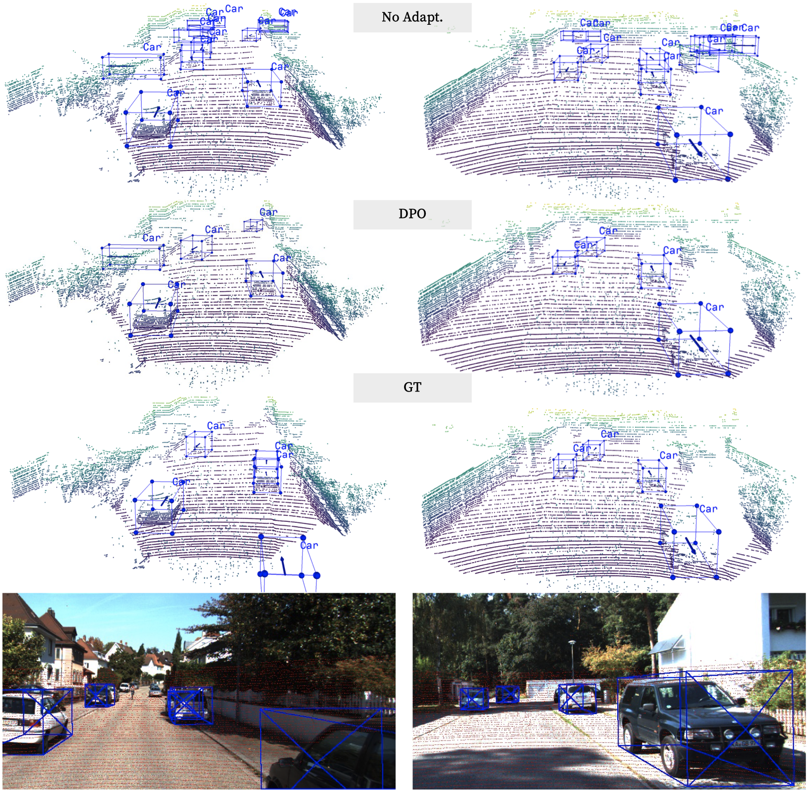
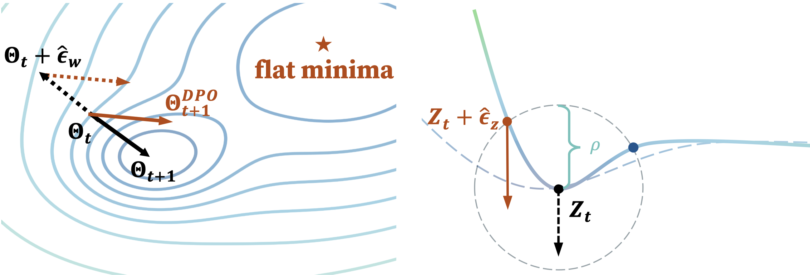

# DPO: Dual-Perturbation Optimization for Test-time Adaptation in 3D Object Detection

Official code release for the paper "**DPO: Dual-Perturbation Optimization for Test-time Adaptation in 3D Object Detection**", published in ACM MM 2024. 


[[OpenReview]](https://openreview.net/forum?id=eoaw2A8X4J) [[arXiv]](https://arxiv.org/abs/2406.13891) 




## Abstract
LiDAR-based 3D object detection has seen impressive advances in recent times. However, deploying trained 3D detectors in the real world often yields unsatisfactory performance when the distribution of the test data significantly deviates from the training data due to different weather conditions, object sizes, etc. A key factor in this performance degradation is the diminished generalizability of pre-trained models, which creates a sharp loss landscape during training. Such sharpness, when encountered during testing, can precipitate significant performance declines, even with minor data variations. To address the aforementioned challenges, we propose dual-perturbation optimization (DPO) for Test-time Adaptation in 3D Object Detection (TTA-3OD). We minimize the sharpness to cultivate a flat loss landscape to ensure model resiliency to minor data variations, thereby enhancing the generalization of the adaptation process. To fully capture the inherent variability of the test point clouds, we further introduce adversarial perturbation to the input BEV features to better simulate the noisy test environment. As the dual perturbation strategy relies on trustworthy supervision signals, we utilize a reliable Hungarian matcher to filter out pseudo-labels sensitive to perturbations. Additionally, we introduce early Hungarian cutoff to avoid error accumulation from incorrect pseudo-labels by halting the adaptation process. Extensive experiments across three types of transfer tasks demonstrate that the proposed DPO significantly surpasses previous state-of-the-art approaches, specifically on Waymo -> KITTI, outperforming the most competitive baseline by 57.72\% in $AP_{3D}$ and reaching 91\% of the fully supervised upper bound. Our code is available at \url{https://github.com/Jo-wang/DPO}.




## Installation

### Environment

All the codes are tested in the following environment:
* Linux (tested on Ubuntu 18.04.6 LTS)
* Python 3.8
* PyTorch 1.10.1
* CUDA 11.3
* [spconv-cu113 v2.3.6](https://github.com/traveller59/spconv)

All packages/libraries tested for this project have been exported to in [requirements.txt](requirements.txt).

Note: [wandb](https://docs.wandb.ai/quickstart) is required to record the information during adaptation.

### Install  `pcdet v0.3`
NOTE: Please re-install `pcdet v0.3` by running `python setup.py develop` even if you have already installed previous version.

[//]: # ()
[//]: # (a. Clone this repository.)

[//]: # (```shell)

[//]: # (git clone ... TODO)

[//]: # (```)

a. Install the dependent libraries as follows:

* Install the dependent python libraries: 
```
pip install -r requirements.txt 
```

b. Install this `pcdet` library by running the following command:
```shell
python setup.py develop
```


## Dataset Preparation

Currently we provide the dataloader of KITTI dataset and NuScenes dataset, and the supporting of more datasets are on the way.  

### KITTI Dataset
* Please download the official [KITTI 3D object detection](http://www.cvlibs.net/datasets/kitti/eval_object.php?obj_benchmark=3d) dataset and organize the downloaded files as follows (the road planes could be downloaded from [[road plane]](https://drive.google.com/file/d/1d5mq0RXRnvHPVeKx6Q612z0YRO1t2wAp/view?usp=sharing), which are optional for data augmentation in the training):
* NOTE: if you already have the data infos from `pcdet v0.1`, you can choose to use the old infos and set the DATABASE_WITH_FAKELIDAR option in tools/cfgs/dataset_configs/kitti_dataset.yaml as True. The second choice is that you can create the infos and gt database again and leave the config unchanged.

```
OpenPCDet
├── data
│   ├── kitti
│   │   │── ImageSets
│   │   │── training
│   │   │   ├──calib & velodyne & label_2 & image_2 & (optional: planes)
│   │   │── testing
│   │   │   ├──calib & velodyne & image_2
├── pcdet
├── tools
```

* Generate the data infos by running the following command: 
```python 
python -m pcdet.datasets.kitti.kitti_dataset create_kitti_infos tools/cfgs/dataset_configs/kitti_dataset.yaml
```


### KITTI-C Dataset
Please follow [Robo3D](https://github.com/ldkong1205/Robo3D) to download and prepare the KITTI-C dataset.


### NuScenes Dataset
* Please download the official [NuScenes 3D object detection dataset](https://www.nuscenes.org/download) and 
organize the downloaded files as follows: 
```
OpenPCDet
├── data
│   ├── nuscenes
│   │   │── v1.0-trainval (or v1.0-mini if you use mini)
│   │   │   │── samples
│   │   │   │── sweeps
│   │   │   │── maps
│   │   │   │── v1.0-trainval  
├── pcdet
├── tools
```

* Install the `nuscenes-devkit` with version `1.0.5` by running the following command: 
```shell script
pip install nuscenes-devkit==1.0.5
```

* Generate the data infos by running the following command (it may take several hours): 
```python 
python -m pcdet.datasets.nuscenes.nuscenes_dataset --func create_nuscenes_infos \ 
    --cfg_file tools/cfgs/dataset_configs/nuscenes_dataset.yaml \
    --version v1.0-trainval
```

### Waymo Open Dataset
* Please download the official [Waymo Open Dataset](https://waymo.com/open/download/), 
including the training data `training_0000.tar~training_0031.tar` and the validation 
data `validation_0000.tar~validation_0007.tar`.
* Unzip all the above `xxxx.tar` files to the directory of `data/waymo/raw_data` as follows (You could get 798 *train* tfrecord and 202 *val* tfrecord ):  
```
OpenPCDet
├── data
│   ├── waymo
│   │   │── ImageSets
│   │   │── raw_data
│   │   │   │── segment-xxxxxxxx.tfrecord
|   |   |   |── ...
|   |   |── waymo_processed_data
│   │   │   │── segment-xxxxxxxx/
|   |   |   |── ...
│   │   │── pcdet_gt_database_train_sampled_xx/
│   │   │── pcdet_waymo_dbinfos_train_sampled_xx.pkl   
├── pcdet
├── tools
```
* Install the official `waymo-open-dataset` by running the following command: 
```shell script
pip3 install --upgrade pip
# tf 2.0.0
pip3 install waymo-open-dataset-tf-2-0-0==1.2.0 --user
```

* Extract point cloud data from tfrecord and generate data infos by running the following command (it takes several hours, 
and you could refer to `data/waymo/waymo_processed_data` to see how many records that have been processed): 
```python 
python -m pcdet.datasets.waymo.waymo_dataset --func create_waymo_infos \
    --cfg_file tools/cfgs/dataset_configs/waymo_dataset.yaml
```

Note that you do not need to install `waymo-open-dataset` if you have already processed the data before and do not need to evaluate with official Waymo Metrics. 

## Get Started!

The dataset configs are located within [tools/cfgs/dataset_configs](../tools/cfgs/dataset_configs), 
and the TTA configs are located within [tools/cfgs/tta_](../tools/cfgs) for different tta tasks.


### Pretrain models on the source domain
```shell script
python train.py --cfg_file ${CONFIG_FILE}
```

For example, pretrain a model on Waymo for TTA on KITTI:
```shell script
python train.py --cfg_file cfgs/tta_w2k_models/secondiou/source_pretrain.yaml \
    --batch_size ${BATCH_SIZE}
```

### Test pretained models

* Test with a pretrained model: 
```shell script
python test.py --cfg_file ${CONFIG_FILE} --batch_size ${BATCH_SIZE} --ckpt ${CKPT}
```

* To test all the saved checkpoints of a specific training setting and draw the performance curve on the Tensorboard, add the `--eval_all` argument: 
```shell script
python test.py --cfg_file ${CONFIG_FILE} --batch_size ${BATCH_SIZE} --eval_all
```

* Notice that if you want to test on the setting with KITTI as **target domain**, 
  please add `--set DATA_CONFIG_TAR.FOV_POINTS_ONLY True` to enable front view
  point cloud only: 
```shell script
python test.py --cfg_file ${CONFIG_FILE} --batch_size ${BATCH_SIZE} --eval_all --set DATA_CONFIG_TAR.FOV_POINTS_ONLY True
```

### Test-Time Adaptation on the target domain
You need to set the `--pretrained_model ${PRETRAINED_MODEL}` to your model pre-trained on the source domain.
```shell script
python tta_adapt.py --cfg_file cfgs/tta_w2k_models/secondiou/dpo.yaml \
    --batch_size ${BATCH_SIZE} --pretrained_model ${PRETRAINED_MODEL}
```

## Acknowledgement

Our code is heavily based on and [ST3D](https://github.com/CVMI-Lab/ST3D) and [OpenPCDet v0.3](https://github.com/open-mmlab/OpenPCDet/commit/e3bec15f1052b4827d942398f20f2db1cb681c01). Thanks for their awesome codebase.
